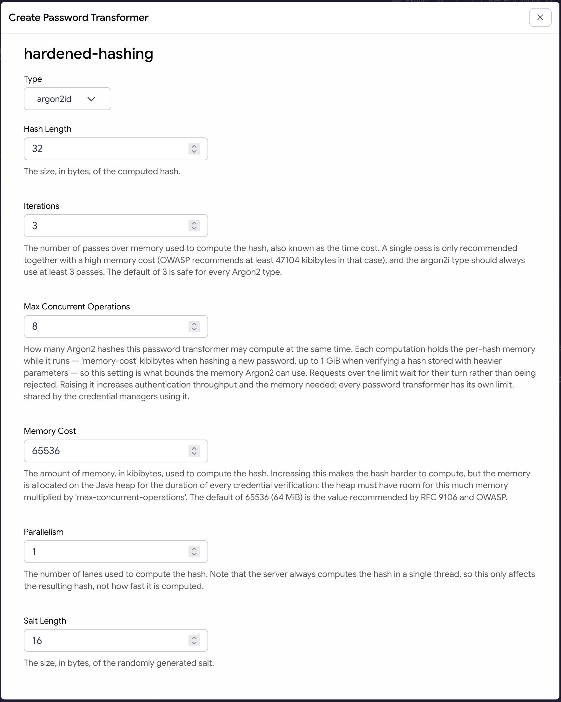
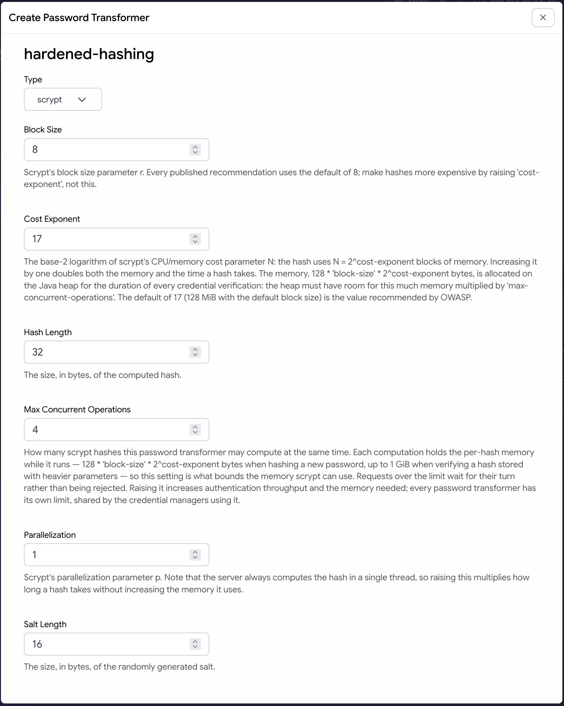

Hardened Hashing Password Transformer Plugin
============================================

.. image:: https://img.shields.io/badge/quality-production-green
    :target: https://curity.io/resources/code-examples/status/

.. image:: https://img.shields.io/badge/availability-binary-blue
    :target: https://curity.io/resources/code-examples/status/

The Hardened Hashing Password Transformer plugin is a Kotlin-based Password Transformer plugin for the
Curity Identity Server. It adds memory-hard password hashing algorithms that an administrator can configure as
Password Transformers and then select for a Credential Manager or use from credential transformation procedures.

Supported Algorithms
--------------------

The plugin provides the three Argon2 variants defined in `RFC 9106 <https://www.rfc-editor.org/rfc/rfc9106.html>`_:

* ``argon2id`` (recommended)
* ``argon2i``
* ``argon2d``

It also provides ``scrypt``, defined in `RFC 7914 <https://www.rfc-editor.org/rfc/rfc7914.html>`_.

Password hashes are stored in the standard `PHC string format <https://c2sp.org/phc-strings>`_, for example:

.. code-block:: text

    $argon2id$v=19$m=65536,t=3,p=1$<salt>$<hash>
    $scrypt$ln=17,r=8,p=1$<salt>$<hash>

This keeps hashes interchangeable with hashes produced by other implementations of the same algorithms.

Building the Plugin
-------------------

If you want to build the plugin from source, use the command ``mvn package``. This will produce a JAR file in the
``target`` directory, which you can then install.

Installing the Plugin
---------------------

To install the plugin, copy the plugin JAR (that you either compiled yourself or unpacked from a downloaded release)
and JARs of the dependencies not provided by the Curity Identity Server
from the ``target`` directory into the :file:`${IDSVR_HOME}/usr/share/plugins/hardened-hashing/`. ``${IDSVR_HOME}``
is the installation folder of the Curity Identity Server. Inside of a Docker container that uses an official image of
the Curity Identity Server, the installation directory is ``/opt/idsvr``. Make sure to copy the JARs to every Curity Identity Server node, including the admin node. Restart the Curity Identity Server so that it can load the
plugin. For more information about installing plugins, refer to the `curity.io/plugins`_.

Required Dependencies
~~~~~~~~~~~~~~~~~~~~~

For a list of the dependencies and their versions, run ``mvn dependency:list``. Ensure that all of these are installed
in the plugin directory, except for the JARs provided by the Curity Identity Server (you can find the provided
dependencies in `the documentation`_). Otherwise, they will not be accessible to this plug-in and run-time errors will
result.

Configuring the Plugin
----------------------

Install the plugin in the Curity Identity Server (see `Installing the Plugin`_), then create a Password
Transformer under **Facilities**. Select one of the algorithms the plugin provides and configure its settings.
Finally, configure a Credential Manager to use that Password Transformer by its ID.

Several Credential Managers may share one Password Transformer. In that case,
they hash credentials identically and share the transformer's configured resource
limits.

You can use a Password Transformer as the main Credential Manager algorithm and
as a source for credential rehashing, in any combination. This makes it possible
to migrate stored hashes both onto and off a plugin-provided algorithm.

.. warning::

    When you store credentials using the JDBC Plugin, update the ``password`` column of the ``credentials`` table
    to support longer hashes. The default database schema defines that column as::

        password    VARCHAR(128) NOT NULL

    The plugin stores hashes in the PHC string format, with the salt and the Base64-encoded hash, so their length
    grows with ``salt-length`` and ``hash-length``. With the default settings (a 16-byte salt
    and a 32-byte hash), an ``argon2id`` hash is about 100 characters long and an ``scrypt`` hash about 90, so
    both fit in the default column. You should widen the column when:

    * ``salt-length`` and ``hash-length`` together exceed 64 bytes, which produces hashes that may not fit in
      128 characters; or
    * the credential store holds hashes longer than 128 characters imported from another system.

    With the maximum allowed settings, a hash can take up to about 2800 characters. Widen the column
    accordingly, for example, in PostgreSQL::

        ALTER TABLE credentials ALTER COLUMN password TYPE VARCHAR(4096);

    The exact syntax depends on the database in use.

Argon2 Settings
~~~~~~~~~~~~~~~

The Argon2 variants allows to configure these settings:

* ``memory-cost``
* ``iterations``
* ``parallelism``
* ``salt-length``
* ``hash-length``
* ``max-concurrent-operations``

SCrypt Settings
~~~~~~~~~~~~~~~

SCrypt allows configuring these settings:

* ``cost-exponent`` — the base-2 logarithm of the ``N`` parameter
* ``block-size``
* ``parallelization``
* ``salt-length``
* ``hash-length``
* ``max-concurrent-operations``

Sizing Argon2 and SCrypt
------------------------

Both algorithm families are deliberately memory-hard. Computing one hash
allocates a configuration-determined amount of memory on the Java heap:

* Argon2 uses ``memory-cost`` kibibytes per hash.
* SCrypt uses ``128 * block-size * 2^cost-exponent`` bytes per hash.

Every credential verification and every password change need that much memory. This is not a per server setting.
The heap therefore has to accommodate all hashes computed at the same time.

The ``max-concurrent-operations`` setting bounds this. At most the per-hash
memory times ``max-concurrent-operations`` is used by a Password Transformer's
hashing, regardless of load. Requests beyond the limit wait for their turn
instead of allocating more memory.

With the defaults, Argon2 uses 64 MiB per hash and allows 8 concurrent
operations, and SCrypt uses 128 MiB per hash and allows 4 concurrent operations.
Both defaults therefore allow up to 512 MiB of hashing memory, so the server's
heap size must be well above that. Each Password Transformer has its own limit,
so totals add up across transformers. Credential Managers sharing a Password
Transformer share its limit.

The plugin uses the configured per-hash memory only when hashing new passwords.
Verifying a password uses the cost parameters recorded in the stored hash, not
the currently configured ones, so that hashes produced with other settings remain
verifiable and can be rehashed on login. If the credential store holds hashes
heavier than the current configuration, for example imported from another system,
size the heap for their cost times ``max-concurrent-operations``, or lower
``max-concurrent-operations`` until they have been rehashed.

Raising ``max-concurrent-operations`` increases how many users can authenticate
at once, at the cost of memory. Lowering the memory a hash uses reduces the
memory that the JVM needs but also makes the hashes easier to crack. Prefer keeping the
recommended cost and tune the concurrency.

FIPS Mode
---------

Neither Argon2 nor SCrypt is a FIPS 140-3-approved algorithm. When the Curity
Identity Server runs in FIPS mode it will reject a Credential Manager configured with a
Password Transformer from this plugin. The Curity Identity Server will reject the Credential Manager
regardless of whether it uses this plugin's transformer as its main algorithm or as a rehashing source.

More Information
----------------

Please visit `curity.io`_ for more information about the Curity Identity Server.

.. _curity.io/plugins: https://curity.io/docs/idsvr/latest/developer-guide/plugins/index.html#plugin-installation
.. _curity.io: https://curity.io/
.. _the documentation: https://curity.io/docs/idsvr/latest/developer-guide/plugins/index.html#server-provided-dependencies-1
